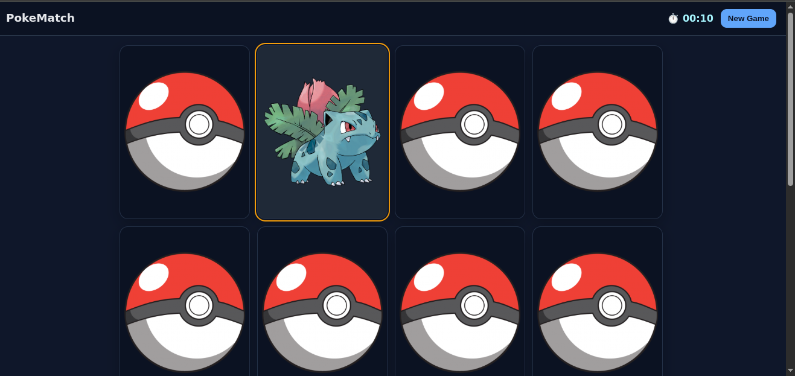

# 🎮 PokéMatch — Pokémon Memory Game

A simple, fun **memory card game** built with **HTML, CSS, and JavaScript**, powered by the **PokéAPI**.  
Flip cards, find pairs of Pokémon, and see how fast you can finish the board!

---

## ✨ Features
- 4 × 4 grid (16 cards, 8 pairs to match)  
- Real Pokémon sprites fetched live from [PokeAPI](https://pokeapi.co/)  
- Timer that starts on your first move  
- "New Game" button to reset and reshuffle  
- Smooth card-flip animations  
- Fully responsive design (works on desktop and mobile)  

---

## 🖼️ Screenshots  
Example:  



---

## 🚀 How to Play
1. Click on any card to flip it.  
2. Flip another card — if they match, they stay open.  
3. If they don’t match, both flip back.  
4. Continue until you match all 8 pairs.  
5. Try to finish in the **fastest time possible!**  

---

## 🛠️ Tech Stack
- **HTML5** → structure  
- **CSS3** → styling, layout, animations  
- **JavaScript (ES6)** → game logic  
- **PokéAPI** → fetch Pokémon sprites dynamically  

---

## 📦 Setup & Run
1. Clone this repository:  
   ```bash
   git clone https://github.com/meet-innovate/pokematch.git
   cd pokematch
    ```
2. Open index.html in your browser.
3. Play  
(No build steps or dependencies — just open and play.)

---

## 🙌 Acknowledgements
- [PokéAPI](https://pokeapi.co/) for the Pokémon data  
- Inspired by the classic **Memory Card Game**  

---

Made with ❤️ by **Meet Patel**